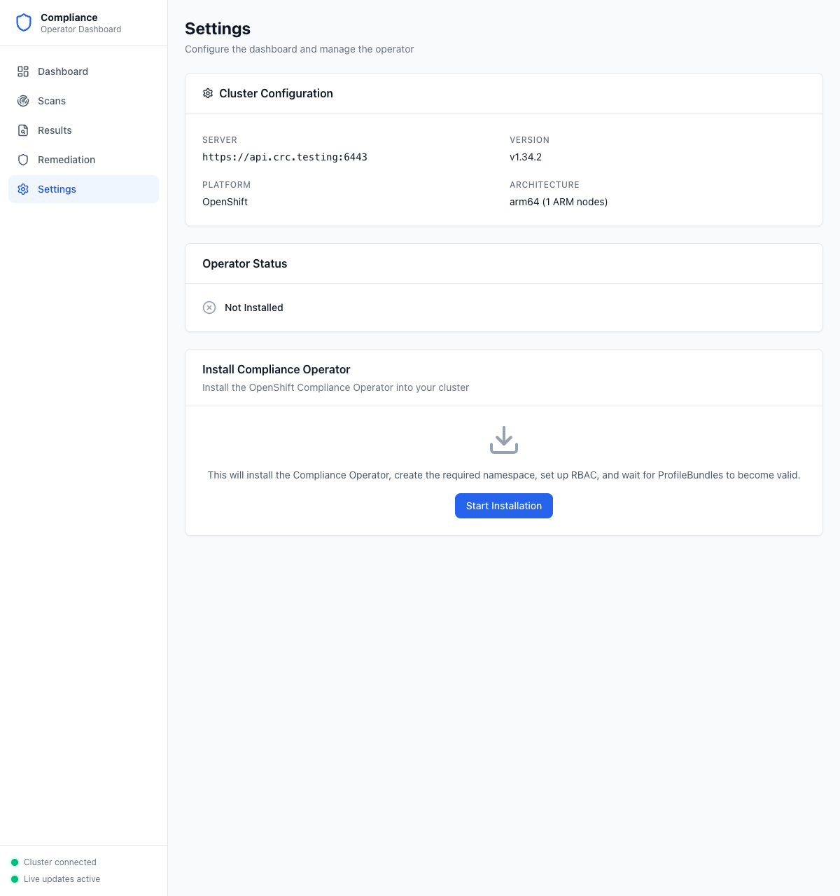
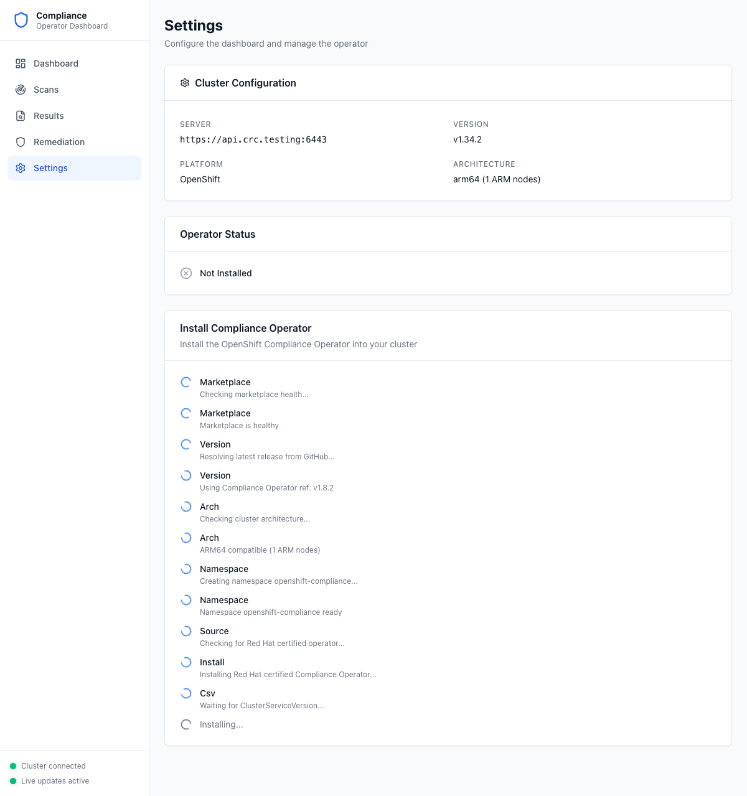
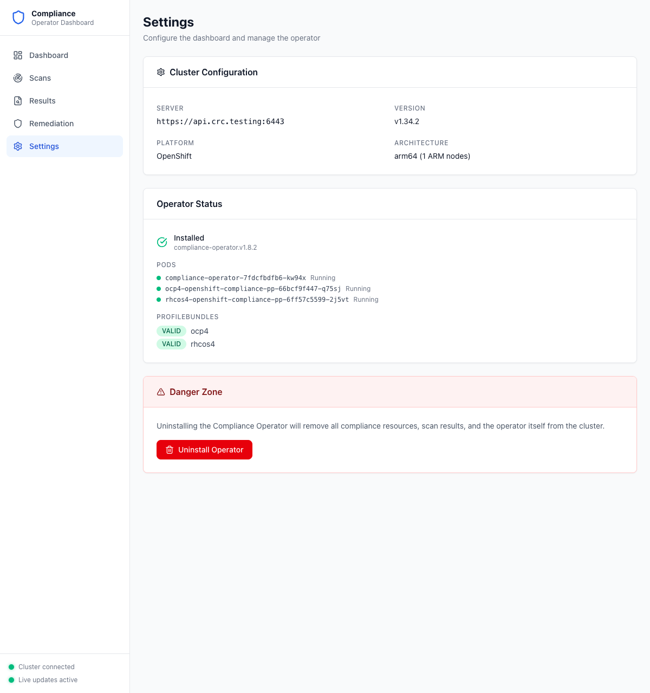

# Step 1: Install the Compliance Operator

The dashboard can install the Compliance Operator directly onto your cluster with a single click.

## Navigate to Settings

Click **Settings** in the sidebar. You'll see your cluster configuration and the current operator status.

**What to look for:**
- **Cluster Configuration** — Confirms the API server URL, OpenShift version, platform, and architecture
- **Operator Status** — Shows "Not Installed" when the operator has not been deployed yet
- **Install Compliance Operator** — The install wizard with the "Start Installation" button

## Start the Installation

Click **Start Installation**. The dashboard auto-detects whether your cluster has the `redhat-operators` catalog source and chooses the appropriate install method:

- **Red Hat certified** — Used when `redhat-operators` is available in `openshift-marketplace`
- **Community/upstream** — Falls back to the `ghcr.io` community image otherwise

Progress steps stream in real time as each phase completes:

**Installation phases you'll see:**
1. **Marketplace** — Checks that the OLM marketplace is healthy
2. **Version** — Resolves the latest operator version
3. **Arch** — Verifies cluster architecture compatibility
4. **Namespace** — Creates `openshift-compliance` namespace
5. **Source** — Detects Red Hat certified or community operator
6. **Install** — Creates the OLM Subscription
7. **CSV** — Waits for the ClusterServiceVersion to succeed
8. **RBAC** — Applies supplemental RBAC for scan jobs
9. **Pods** — Waits for operator pods to become ready

## Verify Installation

Once complete, the Settings page updates to show the installed operator with pod health and ProfileBundle status:

**What to look for:**
- **Operator Status: Installed** — Green checkmark with version (e.g., `compliance-operator.v1.8.2`)
- **Pods** — All operator pods showing "Running" with green indicators
- **ProfileBundles** — `ocp4` and `rhcos4` bundles both showing "VALID"
- **Danger Zone** — Uninstall option (only use when you want to fully remove the operator)

---

**Next step:** [Run Scans](02-run-scans.md)
