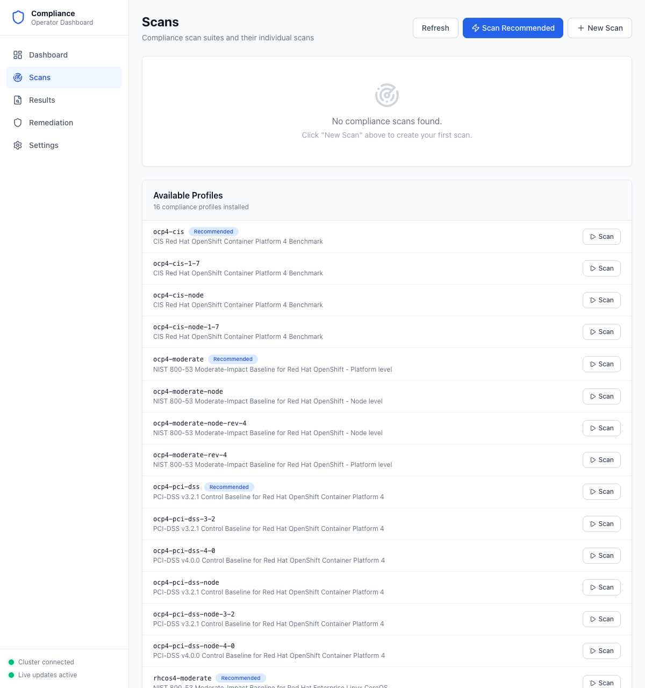
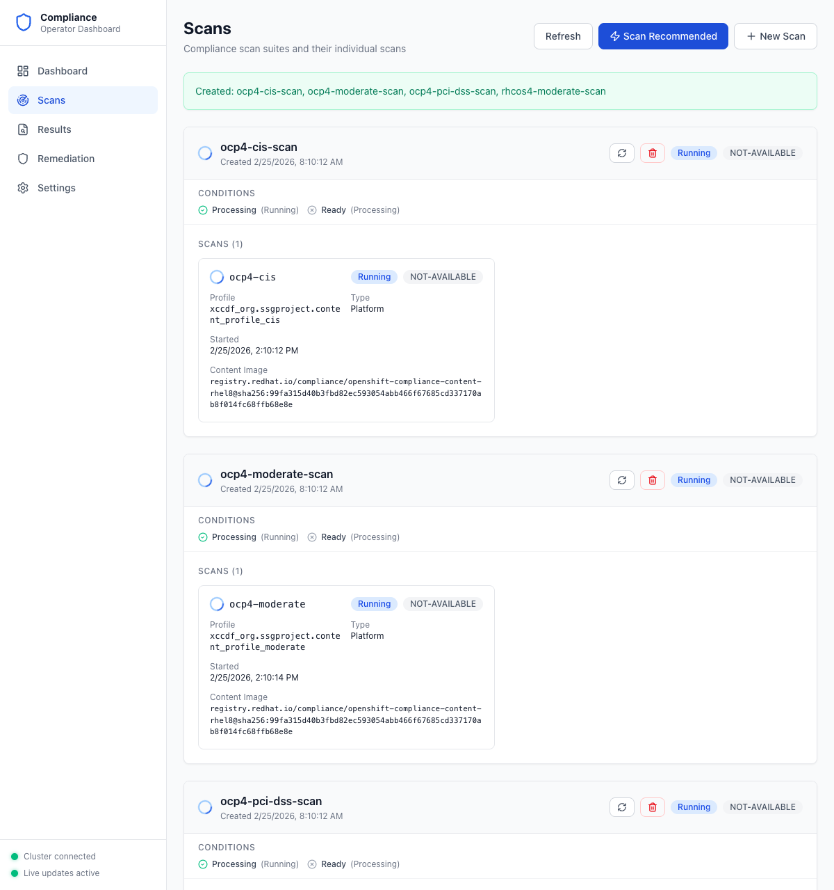
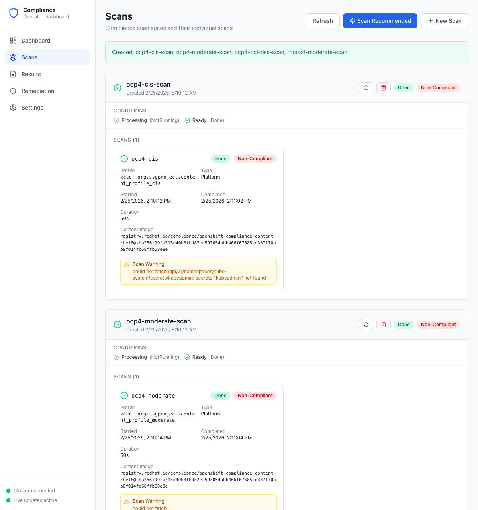

# Step 2: Run Scans

With the operator installed, you can create compliance scans against industry-standard profiles.

## Navigate to Scans

Click **Scans** in the sidebar. Before any scans are created, you'll see an empty state along with the list of available compliance profiles.

**What to look for:**
- **Scan Recommended** button — Creates scan suites for the most common profiles in one click
- **New Scan** button — Create a custom scan from any individual profile
- **Available Profiles** — All profiles installed by the ProfileBundles (e.g., CIS, NIST 800-53, PCI-DSS)
- **Recommended** badge — Profiles that are recommended for most clusters

## Create Scans

You have two options:

### Option A: Scan Recommended (Quickest)

Click **Scan Recommended** to automatically create scan suites for:
- `ocp4-cis` — CIS OpenShift Benchmark
- `ocp4-moderate` — NIST 800-53 Moderate (Platform)
- `ocp4-pci-dss` — PCI-DSS v3.2.1
- `rhcos4-moderate` — NIST 800-53 Moderate (Node-level, master + worker)

### Option B: New Scan (Custom)

Click **New Scan** to pick a specific profile from the dropdown, name the scan, and create it.

You can also click the **Scan** button next to any individual profile in the Available Profiles list.

## Monitor Scan Progress

Once scans are created, they appear with real-time status updates:

**What to look for:**
- **Running** badge — The scan is actively executing on the cluster
- **Conditions** — Shows `Processing (Running)` and `Ready (Processing)` during execution
- **Scan details** — Profile name, scan type (Platform vs Node), start time, and content image
- **Rescan / Delete** buttons — Manage individual scan suites

## Scan Completion

When scans finish, the status updates automatically via WebSocket — no need to refresh:

**What to look for:**
- **Done** badge — The scan has completed
- **Non-Compliant** badge — Indicates the cluster did not fully pass all checks (expected for most environments)
- **Completed** timestamp and **Duration** — Shows when the scan finished and how long it took
- **Scan Warning** — Informational messages about resources that could not be evaluated (non-blocking)

---

**Next step:** [View Results](03-view-results.md)
