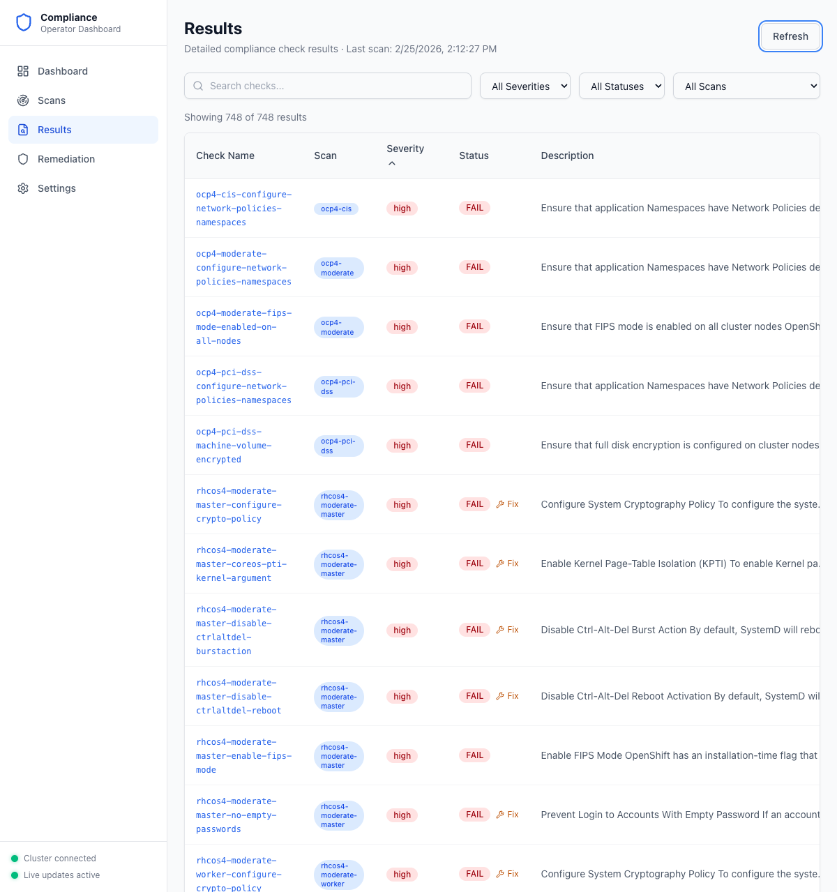
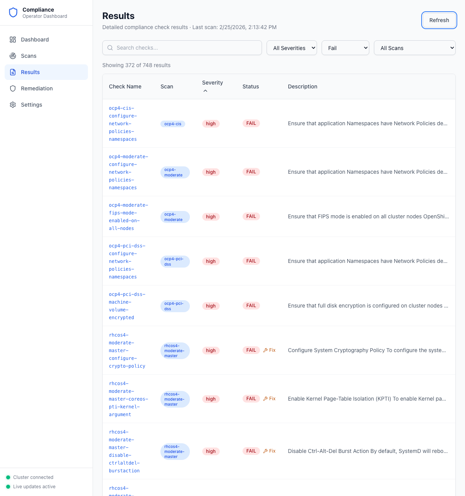

# Step 3: View Results

After scans complete, navigate to the Results page to explore individual compliance checks.

## Results Table

Click **Results** in the sidebar. The results table shows every compliance check across all scans.

**What to look for:**
- **Result count** — Total checks found (e.g., "Showing 748 of 748 results")
- **Last scan timestamp** — When results were last collected
- **Check Name** — Clickable link to the full check detail page
- **Scan** — Which scan suite produced this result
- **Severity** — `high`, `medium`, or `low`
- **Status** — `PASS`, `FAIL`, `MANUAL`, or `SKIP`
- **Fix** link — Appears next to failed checks that have an available remediation

## Filter and Search

Use the filter bar to narrow results:

- **Search** — Type a keyword to filter by check name
- **Severity dropdown** — Filter by High, Medium, or Low
- **Status dropdown** — Filter by Pass, Fail, Manual, or Skip
- **Scan dropdown** — Filter to a specific scan (e.g., `ocp4-cis`, `rhcos4-moderate-master`)

Columns are sortable — click any column header to sort ascending or descending.

## Check Detail Page

Click any check name to open its full detail page with description, rationale, and verification instructions:

**What to look for:**
- **Status and severity badges** — `FAIL` / `high` at the top
- **Remediation Available** banner — Appears for checks that have an automated fix, with a "View Remediation" link
- **Description** — Full explanation of what the check evaluates, often including example Kubernetes manifests
- **Rationale** — Why this check matters for security
- **Instructions** — Manual verification steps you can run to confirm the finding
- **Metadata** — Rule ID, scan name, suite, and linked remediation

---

**Next step:** [Apply Remediations](04-apply-remediations.md)
