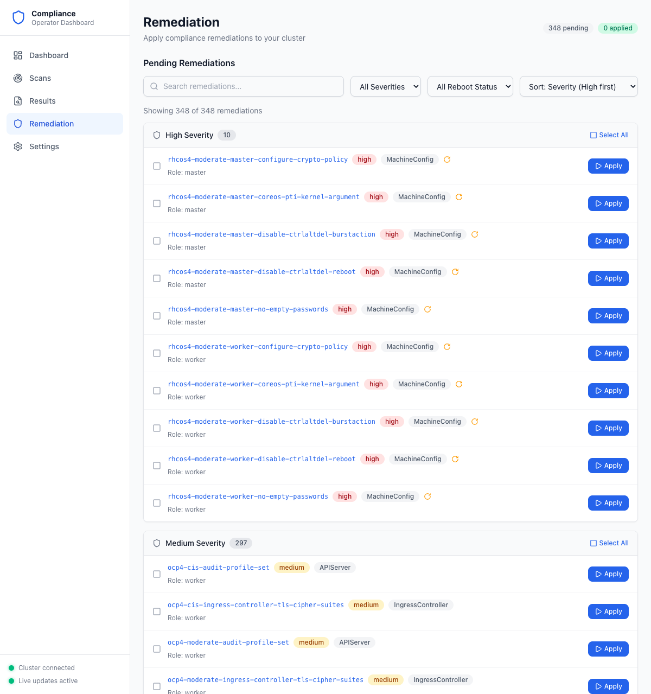

# Step 4: Apply Remediations

The Remediation page lets you review and apply automated fixes for failing compliance checks.

## Navigate to Remediation

Click **Remediation** in the sidebar. Remediations are grouped by severity with high-severity items shown first.

**What to look for:**
- **Pending / Applied counts** — Summary at the top (e.g., "348 pending", "0 applied")
- **Severity groups** — Remediations organized under High, Medium, and Low headings with counts
- **Remediation name** — Clickable link to the full remediation detail page
- **Severity badge** — `high`, `medium`, or `low`
- **Kind** — The Kubernetes resource type (e.g., `MachineConfig`, `APIServer`, `IngressController`)
- **Reboot icon** — Indicates the remediation requires a node reboot (common for `MachineConfig` types)
- **Role** — Which node role is affected (`master`, `worker`)
- **Apply** button — Applies the remediation to the cluster

## Filter and Sort

Use the controls at the top to focus on specific remediations:

- **Search** — Filter by remediation name
- **Severity dropdown** — Show only High, Medium, or Low
- **Reboot Status dropdown** — Filter by "Requires Reboot" or "No Reboot"
- **Sort dropdown** — Sort by severity, name, or reboot requirement

## Apply a Single Remediation

Click the **Apply** button next to any remediation. A confirmation dialog will appear before the fix is applied to the cluster.

For remediations that require a reboot (indicated by the reboot icon), the dialog will include a warning about node restarts.

## Batch Apply

Use the checkboxes to select multiple remediations, then click **Apply Selected** in the action bar that appears at the bottom.

You can also use the **Select All** button within a severity group to select all remediations of that severity level at once.

## Remediation Detail

Click any remediation name to see its full detail page, which includes:

- Remediation metadata (kind, API version, namespace, role, status)
- The full YAML of the Kubernetes object that will be applied
- Whether a reboot is required

This is useful for understanding exactly what changes will be made before applying.

---

**Next step:** [Monitor Compliance](05-monitor-compliance.md)
