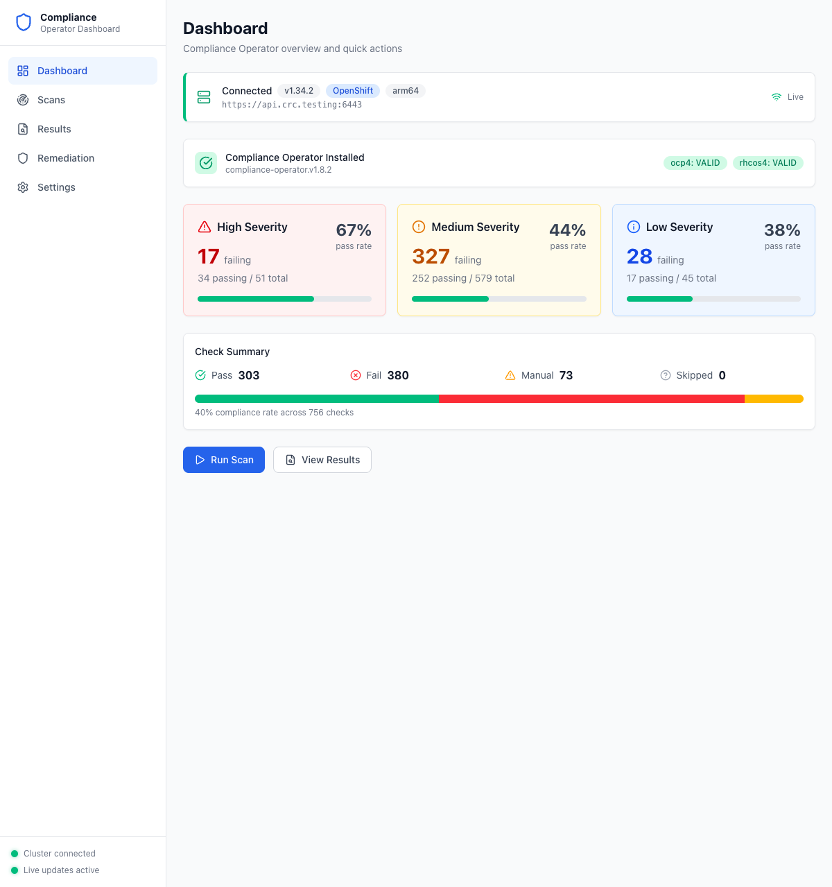

# Step 5: Monitor Compliance

After applying remediations, use the Dashboard to track your overall compliance posture.

## Dashboard Overview

Click **Dashboard** in the sidebar to see your compliance summary at a glance.

**What to look for:**
- **Operator status banner** — Confirms the operator is installed with version and valid ProfileBundles
- **Severity cards** — Show failing count, passing count, total, and pass rate percentage for High, Medium, and Low
- **Check Summary** — Aggregated counts for Pass, Fail, Manual, and Skipped checks with a visual progress bar
- **Overall compliance rate** — Percentage across all checks (e.g., "40% compliance rate across 756 checks")

## Rescan After Remediations

After applying remediations, rescan to verify your fixes:

1. Click **Run Scan** on the Dashboard, or navigate to **Scans**
2. Click the **Rescan** button (circular arrow icon) on any existing scan suite
3. Wait for the scan to complete — status updates stream in real time
4. Return to the **Dashboard** to see updated compliance metrics

## Real-Time Updates

The dashboard uses WebSocket connections to stream updates from Kubernetes watch events. You'll see changes reflected immediately without manual refreshing:

- Scan status transitions (Running, Aggregating, Done)
- New check results appearing
- Remediation status changes

The status footer in the sidebar shows connection health:
- **Green dot — Cluster connected** / **Live updates active**: Everything is working
- **Red dot — Cluster disconnected** / **Live updates offline**: Check your kubeconfig or network

## Ongoing Compliance Workflow

1. **Run scans** periodically or after cluster changes
2. **Review results** — Focus on high-severity failures first
3. **Apply remediations** — Use batch apply for efficiency
4. **Rescan** to verify improvements
5. **Monitor** the dashboard for compliance drift

---

**Back to:** [Getting Started](getting-started.md)
