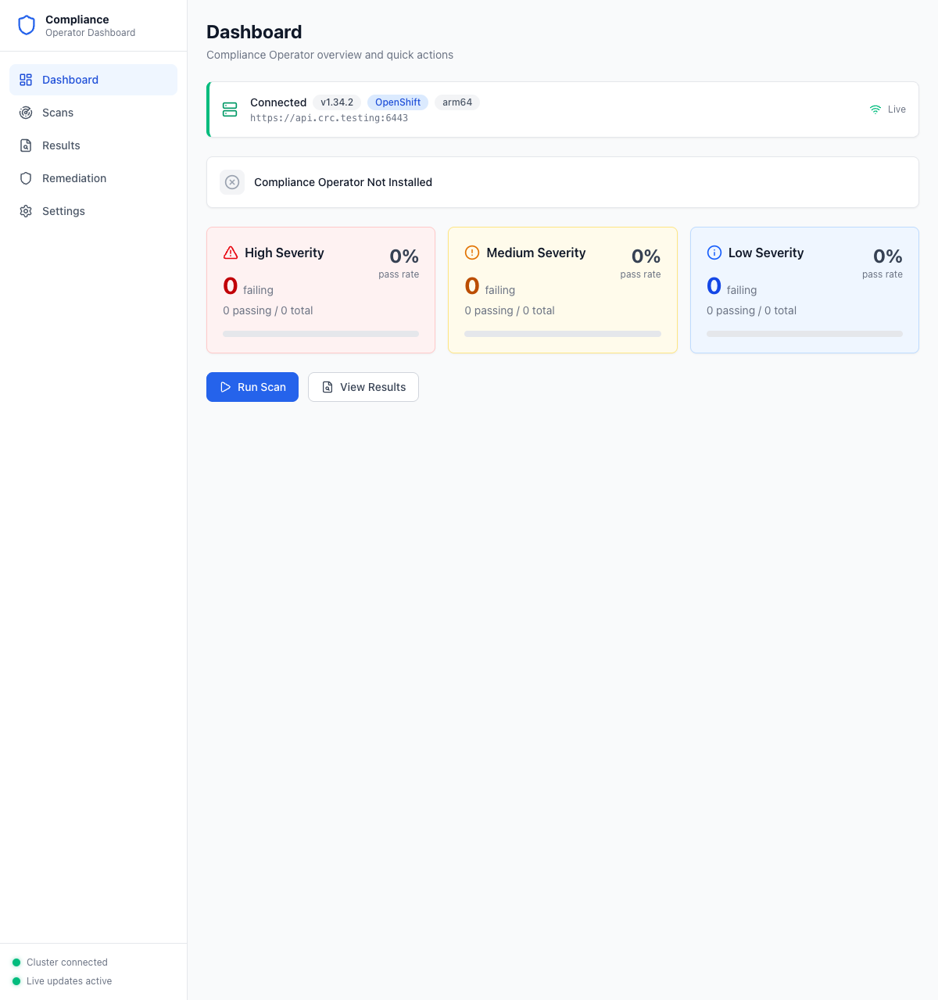

# Getting Started

This guide walks you through using the Compliance Operator Dashboard — from first launch to viewing scan results and applying remediations.

## Prerequisites

- Access to an OpenShift cluster with `oc` / kubeconfig configured
- Go 1.22+ and Node.js 18+ (to build from source)

## Build and Launch

```bash
make build
./bin/compliance-operator-dashboard serve
```

The dashboard starts at [http://localhost:8080](http://localhost:8080).

## First Launch

When you first open the dashboard, you'll see the main overview with your cluster connection status. If the Compliance Operator is not yet installed, the severity cards will show zeros and the operator status banner will indicate it needs to be installed.



**What to look for:**
- **Sidebar** (left) — Navigation to all pages: Dashboard, Scans, Results, Remediation, Settings
- **Cluster info bar** — Shows your cluster API URL, version, platform, and architecture
- **Status footer** — Green dots for "Cluster connected" and "Live updates active" confirm connectivity

## Next Steps

| Step | Description |
|------|-------------|
| [1. Install the Operator](01-install-operator.md) | Install the Compliance Operator onto your cluster |
| [2. Run Scans](02-run-scans.md) | Create and run compliance scans |
| [3. View Results](03-view-results.md) | Explore scan results and check details |
| [4. Apply Remediations](04-apply-remediations.md) | Fix failing checks with one-click remediations |
| [5. Monitor Compliance](05-monitor-compliance.md) | Use the dashboard to track your compliance posture |
